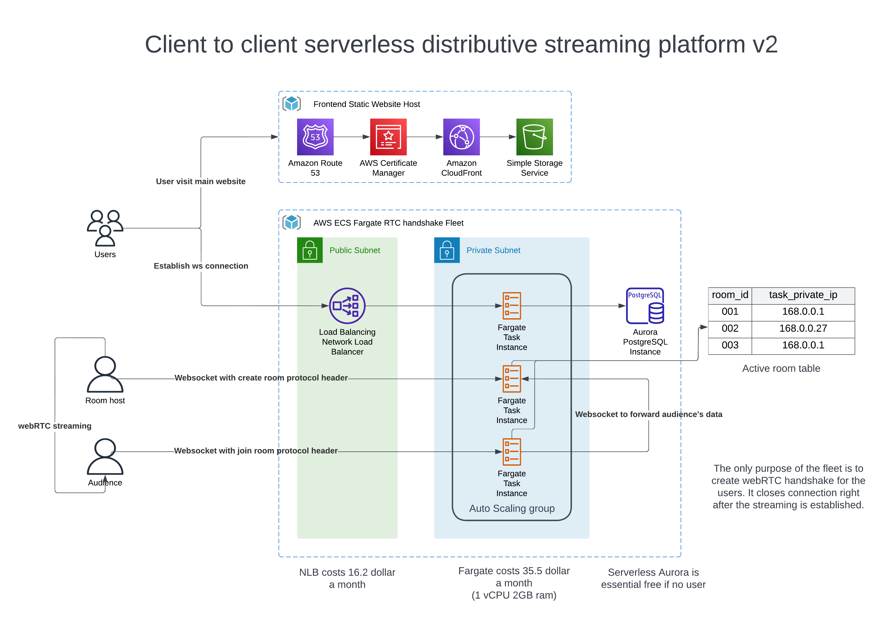

# Virtual-Avatar-Stream
This is a serverless, auto-scaling, highly available, highly resilient, and highly secured backend of [virtual-avatar](https://github.com/Trip1eLift/virtual-avatar) to support client-to-client data streaming. With sufficient code change, it can turn into a serverless & scalable game server.

## License

“Commons Clause” License Condition v1.0

The Software is provided to you by the Licensor under the License, as defined below, subject to the following condition.

Without limiting other conditions in the License, the grant of rights under the License will not include, and the License does not grant to you,  right to Sell the Software.

For purposes of the foregoing, “Sell” means practicing any or all of the rights granted to you under the License to provide to third parties, for a fee or other consideration (including without limitation fees for hosting or consulting/ support services related to the Software), a product or service whose value derives, entirely or substantially, from the functionality of the Software.  Any license notice or attribution required by the License must also include this Commons Cause License Condition notice.

Software: Virtual Avatar Stream
License: Apache 2.0
Licensor: Trip1eLift - Joseph Chang
